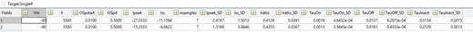
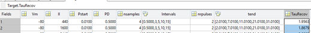

# Fit-tool Double Two-State Opsin Model
A double two-state opsin model was proposed to be a good alternative for opsin modelling. The model consists of two state pairs. The first one represents the opening and closing of the channel. The other represents the light dark adaptation of the channel conductance, acting thus as a conductance regulator. For the rationale behind the model and structure we refer to:

Schoeters, R., Tarnaud, T., Martens, L., Joseph, W., Raedt, R., & Tanghe, E. (2021). Double Two-State Opsin Model With Autonomous Parameter Inference. Frontiers in Computational Neuroscience.
https://doi.org/10.3389/fncom.2021.688331

## Content
* **Compile_script**: create standalone application (see comments inside script)
* **runfit22HH_LIS**: run fit22HH (fit tool master function) while adding extra metadata and save output. Possibility to send email when done, start profiler and save figures.
* **runfit22OM**: create input file or start fit. Contains examples of hyperparameters that can be changed. (more examples in runfit_specificOpsin folder)
* **Results folder**: place where results are stored
* **Targets folder**: place where target file is located
* **Inputs folder**: Place where input file is stored prior starting fit. Input file contains target filename and location as well as additional settings. If using subfolders, do not forget to include subfolder name when passing to fit22HH or runfit22HH_LIS
* **Functions folder**: Contains all functions used during fitting procedure

## Functions

The master function of the fitting procedure. It requires an Input structure which contains the targets filename. Also, possible to add extra settings through varargin (or via a single cell containing all parameter name and value pairs). As output, the fitted parameters are given of each step with additional metadata.

Important is the Target structure which should at least contain a SingleP field (Target.SingleP, single pulse experiments). If data of two pulse experiments is available, Target.TauRecov can be added as well. The features are stored as follows:

Standard deviations (e.g., Ipeak_SD) are not mandatory. Usage depends on selected cost-function method. Preferably, Vm (voltage clamp value) is in mV, Il in W/m2, time constants in seconds as well as pulse start and duration (OSpstart, OSpd with OSp = optical stimulation pulse). Units of current features (Ipeak, Iss) is free of choice (but the same for all) but the range of gChR2 should be chosen accordingly. The above mentioned units are prefered, however not mandatory. The reason whi is because the starting points, lower and upper bounds in the **load_functionDB** are based on these units. If data is available on TauRecov: it should be stored as follows:

After loading the target data. The hyperparameters are determined through the **declare_parameter** function. Changes given via settings/varargin are made accordingly. Depending on chosen options, some checkups are performed prior start of fit. Next, doubles in target file are combined and the target file is sorted (sort is not mandatory but improves plot quality). Next the relationships can be plotted via **plotFeature**.

Prior start of the first fit, the target data and weights are stored in the correct format and altered if needed, **genXYFB** (see intermediate fit through approximation). The new time constant targets are plot via **plotTau**. Next the intensity and voltage dependencies are loaded from the **load_functionDB**. Depending on the selected fitOrder the intermediate fit is created (i.e., first estimation of parameter values see paper for more details.). The result of this intermediate fit is visualized with the **runODE** function. Finally, a final optimization is performed (**final_opt**) including all parameters on a limited parameter space.

## Subfunctions
Functions are ordered based on occurrence in fit22HH. Extra info can typically be found inside the function

1. **Declare_parameters**: Contains the default settings of the fitting procedure. Settings are altered via settings cell which contains a name-value pair. For more details on parameters we refer to declare_parameters function and parameters_ReadMe.txt
2. **adjFields**: Function that merges structures and changes default fields.

3. **plotFeatures**: create a plot of the I and V dependencies of the features.
4. **genXYFB**: reorganize target data. Determine weights (if necessary, depends on selected methods), make changes to target features (needed when higher powers are used or in case of TauRecov see paper). Light dependencies of Tau off and recov are averaged out (model is not able to represent these)

5. **PlotTau**: Create a figure of the TauO and TauDA training data
6. **Load_functionDB**: Database that contains multiple functions which can be used as dependencies. If new relationship defined it can be added here or given as input through the settings. Check here on format of dependencies.. Defined sets (with multiple possibilities) probably won’t work anymore. Change made on how we loop through dependencies (see final_opt). names list need to have the same length. *!(Some adjustments need to be made if testing multiple dependencies in one fit as in current format it is possible that during the intermediate step a same fit is made multiple times …)!*
7. **fitORDER**: Not a function but important to elaborate on. To fit the steady state values, already an approximation of the timeconstants is required (see paper). Either these are approximated via the training time constants tauon, off, inact,… or a fit of tauO and tauDA is made first. The latter method is preferred when datapoints of the timeconstants and current features do not coincide (see paper Williams). The former method subordinates TauO  to the (and more specifically tauoff model) to the already fitted steady state values. (see constraint paper to make current return back to baseline after optical pulse)
8. **fitTau**: function that fits tauO and tauDA to target data generated in genXYFB
9. **objfun_Tau**: weighted normalized costfunction used in fitTau with ‘fmincon’ SolverMethod nonlinconTau function defining nonlinear constraints in Taufit (see paper)

10. **fitGODA_IpIssBased**: fit steady state dependencies (Oinf, DAinf) based on current features (Ipeak, Iss and Iratio, last one if specified)
11. **fitGODA_allfeatBased**: same purpose as above only used when fit order set to GODA-tDA-tO. Mean-ing steady-state values fit prior time constants (see explanation fitORDER)

12. **nonlincon**: nonlinear constraints function used in fitGODA_allfeatBased, fitGO-DA_IpIssBased and final_opt

13. **runODE**: recreate voltage clamp experiments with intermediate or final fitted model.

14. **States_Vclamp**: Differential equations that need to be solved

15. **Final_opt**: Final optimization. An overall costfunction is defined: **objfun_CT**, comparing currentraces (needs to be validated) or **objfun_FB** (feature based costfunction see paper), includingthe complete model and the trimmed parameter space based on intermediate fit. The features are determined as would be done on experimental date (via **Extrac_feat**). No more approximations (except if requested see Taurecov, through method_tr but currentraces is prefferd).

16. **EstimTauRecov**:
Rescale taurecov obtained by model with power b (if DA or R(in paper) is raised to the power b). However Taurecov model is approximated.

17. **Outfun and stopPSO**:
Functions to stop the particle swarm optimization algorithm when stuck in singularity.

## Bounded particle swarm optimization
PSObc uses a bounded particle swarm optimization which is not standard builtin to matlab. PSObc can be downloaded from matlabcentral. Just add to path
https://nl.mathworks.com/matlabcentral/fileexchange/25986-constrained-particle-swarm-optimization

